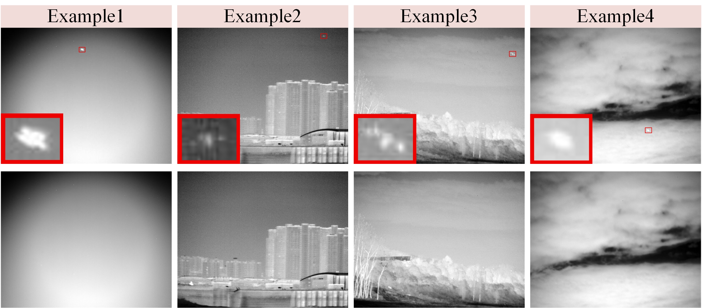

# PairUAV-150

**PairUAV-150: A Paired Infrared UAV Small Target Dataset**

This repository serves as the public homepage of **PairUAV-150**.

---


# Overview

**PairUAV-150** is a paired infrared dataset for UAV small target analysis.

The dataset consists of **150 paired sample groups**, and each group contains:

- one **target-present infrared image** containing a UAV small target
- one corresponding **target-absent infrared image**
- one **mask annotation**
- one **XML bounding-box annotation**

The dataset was acquired using a **long-wave cooled infrared imaging system** and is intended for research on infrared UAV small targets.

# Highlights

- **Paired sample design**: each group contains both target-present and target-absent images for controlled comparison
- **Dual annotation formats**: both pixel-level mask annotations and XML bounding-box annotations are provided
- **Focused on infrared UAV small targets**: suitable for detection, segmentation, and related evaluation tasks
- **Useful for fusion/synthesis evaluation**: applicable to target extraction, target insertion, target-background fusion, and realism assessment of synthetic results

# Dataset Information

- **Dataset name**: PairUAV-150
- **Number of paired groups**: 150
- **Imaging device**: long-wave cooled infrared imaging system
- **Target category**: UAV small targets
- **Annotation types**:
  - binary mask annotation
  - XML bounding-box annotation

# Download

The dataset can be accessed via the following link:

- **Baidu Netdisk**: [[Download Link](https://pan.baidu.com/s/17D4QfnaMA61I-m468QCGAw)]
- **Extraction code**: `x9cr`

> Note: This GitHub repository serves as the public homepage and documentation page of the dataset, while the full dataset is distributed via the external link above.


# Potential Research Uses

PairUAV-150 can be used for, but is not limited to:

1. infrared UAV small target detection
2. infrared small target segmentation
3. evaluation of target extraction methods
4. evaluation of target insertion and synthesis methods
5. evaluation of target-background fusion methods
6. paired analysis of target presence under controlled conditions

In particular, because the dataset provides paired target-present and target-absent samples, it is suitable for assessing whether a method can preserve background consistency while introducing realistic target responses.

# Visual Examples

Several representative paired samples can be displayed below.

## Examples

<p align="center">
  
</p>


# License

This dataset is released for **academic research only**.

Commercial use, redistribution, or any other use beyond academic research is not allowed without prior permission from the authors.

A formal license file may be added later if needed.

# Citation

If you use this dataset in your research, please cite the related paper or the dataset homepage.


## Citation of the paper and dataset

```bibtex
@article{yourpaper2026,
  title={Your Paper Title},
  author={Author One and Author Two and Author Three},
  journal={TBD},
  year={2026},
  note={To be updated after publication}
}
```

# Contact

For questions about the dataset, please contact:

- **Name**: YOUR_NAME
- **Email**: YOUR_EMAIL
